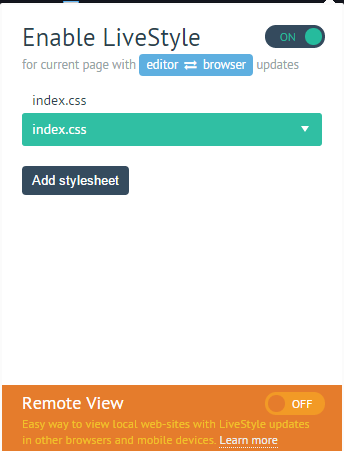

###控制台与编辑器内代码双向绑定

演示如下：

###插件介绍

1.SublimeServer：sublime插件

<a href="http://learningcn.com/SublimeServer/">http://learningcn.com/SublimeServer/</a>

2.livestyle：谷歌浏览器插件

Emmet LiveStyle : the first bi-directional real-time edit tool for CSS, LESS and SCSS.
ID: diebikgmpmeppiilkaijjbdgciafajmg

###下载插件方法：

（1）sublime软件安装（如果是免安装则可能无法正常使用sublimeServer插件）

SublimeServer插件安装
liveStyle插件安装

（2）浏览器谷歌插件安装

打开`<a href="http://yurl.sinaapp.com/crx.php">http://yurl.sinaapp.com/crx.php</a>`,输入应用ID 	`diebikgmpmeppiilkaijjbdgciafajmg`,或直接翻墙下载谷歌拓展程序：Emmet LiveStyle

（3）在电脑安装liveStyle软件，下载地址`<a href="http://livestyle.io/">http://livestyle.io/</a>`

###使用方法：

（1）在sublime text编辑其中，点击菜单栏`tools`->`SublimeServer`->`start SublimeServer`启动服务环境；

（2）右键html页面，点击`view in SublimeServer`打开页面，将localhost手动修改为本地IP，端口号默认为`:8080`（端口号可以在SublimeServer->setting配置）

例：`http://192.168.30.152:8083/sublime/test/test_server.html`

（3）启动浏览器插件liveStyle，将Enable LiveStyle状态调为 on

（4）F12在浏览器修改样式，即可对应修改css，同时刷新页面显示效果，值得注意的是同步页面的css其实没真正保存，所以sublime经修改的css最后要手动保存。

附：
关于sublime text的安装：按 `ctrl+` `调出控制台，前往 <a href="https://packagecontrol.io/installation#st2">https://packagecontrol.io/installation#st2</a> 不同版本的Python代码，重启，完成安装；
然后`ctrl+shift+P` 输入`install package` 按回车键安装，重启；
最后 安装livestyle：
`ctrl+shift+P`

`install package` 

livestyle

