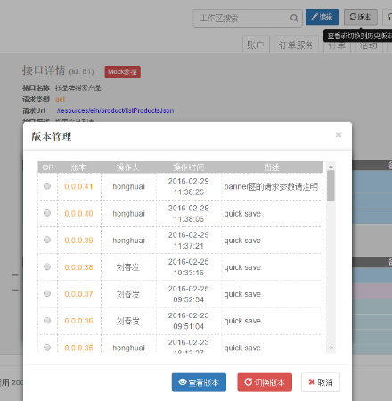

* [一、解决问题：专为接口编辑而设计，解决“接口文档不全，更新不及时”](#1)   
* [二、开发模式：前后端分离    ](#2)  
* [三、统一规范：接口地址、参数、类型、含义    ](#3)  
* [四、版本历史管理    ](#4)  
* [五.用户场景  ](#5)  
* [六.对比传统模式    ](#6)  
* [七.在线使用手册    ](#7)  
* [八.特别注意  ](#8)  

__________________________________________

<h2 id="1">一、解决问题：专为接口编辑而设计，解决“接口文档不全，更新不及时”</h2>

保证接口的全面、实时、正确，保证文档编辑的高效、方便。

* 高效性：接口可复制、可移动、重复利用。

* 方便性：可以根据不同模块、页面、功能进行可视化接口管理

<h2 id="2">二、开发模式：前后端分离</h2>
前端 ===》 **API接口文档（唯一协议）**  《=== 后端

接口变化通过更新RAP中的接口文档，进而反馈给前端（`web`/`android`/`ios`）,前端通过分析这些文档数据，重复利用、生成自测数据。

接口详情 (id: `81`)     Mock数据

接口名称 ：按品牌搜索产品

请求类型 ：get

请求Url  ：/resources/eih/product/listProductsJson

接口描述 ：搜索产品列表

请求参数列表：
<table>
    <tr>
        <td>变量名</td>
        <td>含义</td>
        <td>类型</td>
        <td>备注</td>
    </tr>
    <tr>
        <td>category</td>
        <td>产品分类代码,按需要传PB[A-P]</td>
        <td>string</td>
        <td>备注</td>
    </tr>
    <tr>
        <td>rows</td>
        <td>查询产品个数</td>
        <td>string</td>
        <td> </td>
    </tr>
    <tr>
        <td>spreadFlag</td>
        <td>推荐标志，传固定值Y</td>
        <td>string</td>
        <td> </td>
    </tr>
</table>

响应参数列表：略。

<h2 id="3">三、统一规范：接口地址、参数、类型、含义</h2>
Rap接口文档：

真实json数据：
<pre>
{
  "name_local": "honghuai2",
  "sex": "男",
  "third": "like",
  "page": "22"
}
</pre>
请求方法以及引用链接顺序：

``

`` 

<!--disableLog=true仅保留控制台输出的必要部分-->
<!--mode=1表示都拦截，显示的是模拟数据，为0则表示不拦截，用于校验真实数据与模拟数据-->

``

校验结果（需要设置插件参数mode=0表示不拦截）：

进阶：用mock.js语法编写规则，根据接口文档中的结构动态验证后端实际返回的正确性，在联调前扫清绝大部分后端格式错误。

<h2 id="4">四、版本历史管理</h2>
使用“慢存”输入版本描述信息。可“查看版本”以及“切换版本”。

<h2 id="5">五.用户场景</h2>

后端-》制定接口，校验真实输出格式

前端-》根据约定接口，生成自测数据

测试-》录制mock规则，实现自动化测试

<h2 id="6">六.对比传统模式</h2>
耗时：手写模拟数据（json数据直接导入）

规范：无法可视化规范接口接口地址、参数、类型、含义等

维护：不进行持续性维护，逐渐失效，接口成为作废

快捷：无法可视化编辑

<h2 id="7">七.在线使用手册</h2>
官网：<a href="http://thx.github.io/RAP/index_zh.html">http://thx.github.io/RAP/index_zh.html</a>

github:<a href="https://github.com/thx/RAP">https://github.com/thx/RAP</a>

手册：<a href="https://github.com/thx/RAP/wiki/user_manual_cn">https://github.com/thx/RAP/wiki/user_manual_cn</a>

以上手册网址，目录结构截图如下：

<h2 id="8">八.特别注意</h2>
####（1）RESTFul API根据实际传参值决定所匹配接口

*/data/getItem?{path}=delete  // 删除接口*

*/data/getItem?{path}=update  // 更新接口*

上面两个接口的路径一样，path传参不同。实际开发过程中，可用ajax请求以下链接url表示统一接口不同method的操作方法：

*“/data/getItem?path=delete“  // 删除接口*

*“/data/getItem?path=update“  // 更新接口*

除了**restful**的`GET`/`POST`/`PUT`/`DELETE`方法，一般还有类似status=`0`/`1`/`2`等状态判断值，可采用此restful api（将该参数用`{path}`标记出来，并赋值，这样MOCK工具在匹配该接口时，会根据参数`path`的值来匹配到正确的接口）。

####（2）导入导出项目数据

更多功能-》导入、导出备份

####（3）AngularJS如何使用RAP插件：

下载地址：<a href="https://github.com/goto100/ng-rap">https://github.com/goto100/ng-rap</a>

使用方法：

<pre>angular.module('myApp', ['ngRap']).config(['$httpProvider', 'ngRapProvider', function(httpProvider, ngRapProvider) {
    ngRapProvider.script = 'http://xxx.xxx.xxx/rap.plugin.js?projectId=nnn'; // replce your host and project id
    ngRapProvider.enable({
        mode: 3
    });
    httpProvider.interceptors.push('rapMockInterceptor');
}]);</pre>